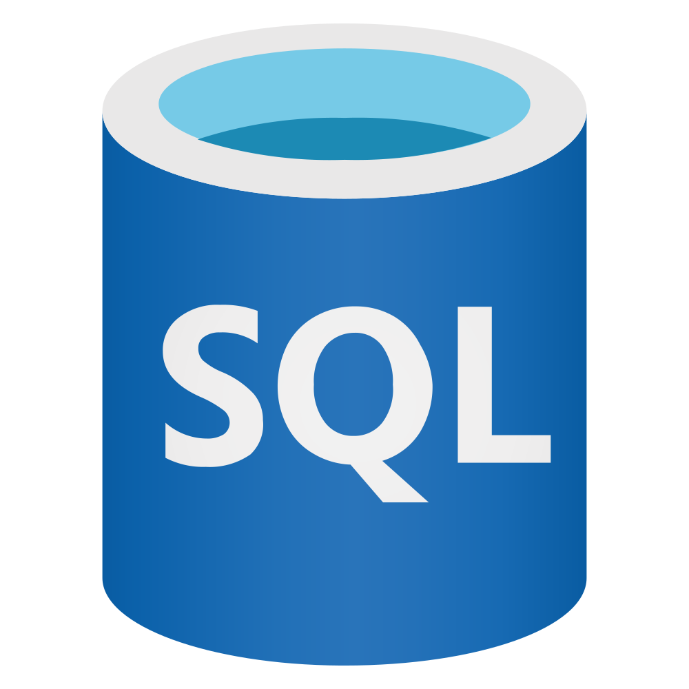
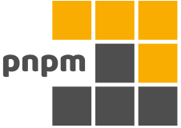

# Hola mi nombre es Carlos 👋

### Soy desarrollador web junior apasionado por los desafíos y el aprendizaje continuo, buscando oportunidades para explorar nuevas tecnologías y mejorar mis habilidades.
 

#### [Mi Porfolio 📁](https://carlos-portafolio.vercel.app) donde encontrarás mis proyectos personales

**Tecnologías 💻**

**Herramientas 🛠️**

**Contacto 📩** 

[linkedin](https://www.linkedin.com/in/carlos-pereyra-0b1014274)

